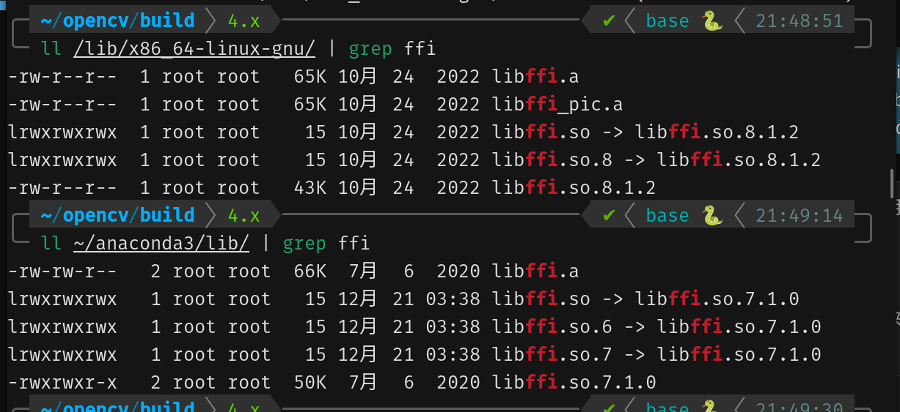

# ultralytics + opencv

## 奇怪的问题

1. 在运行代码的时候出现了 `cv2.error: opencv(4.9.0) /io/opencv/modules/highgui/src/window.cpp:1272: error: (-2:unspecified error) the function is not implemented.`
的报错，官方建议重新下载opencv源代码进行编译，但是我这里会产生anaconda和gnu_lib的版本不对齐的问题(如下)

但是经过尝试，由于我的 `opencv-python` 是通过 pip 直接下载的，所以最简单的方法就是重新下载 opencv

2. 对于 `supervision.Decisions.from_yolov8()` 当前版本已经舍弃，方法变为 `from_ultralytics()`
3. 在获取 标签和置信度的时候由于版本更新，需要把 `for` 的解包对象 变成 `detection.xyxy` 